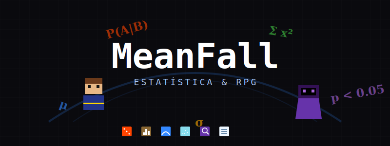

# MeanFall



> **RPG educacional de estatística — jogue em [meanfall.pro](https://www.meanfall.pro)**

Um RPG top-down que ensina estatística através de exploração tile-based, combate por turnos e um sistema elemental completo. O jogador responde questões de estatística para causar dano, coleta loot elemental, completa missões e progride por seis regiões temáticas — cada uma ligada a um tópico diferente de estatística.

Feito com JavaScript vanilla e Phaser 3. Single-page application, sem build step, sem bundler, sem dependências além do CDN do Phaser.

---

## 🎮 Jogar Agora

**[www.meanfall.pro](https://www.meanfall.pro)**

---

## Regiões do Mundo

| Região | Tópico | Elemento | Nível Sugerido |
|---|---|---|---|
| Vila dos Dados | Tipos de dados (categórico, ordinal, contínuo) | Normal | 1 |
| Pradarias das Medidas | Média, mediana, moda | Terra | 3 |
| Floresta da Dispersão | Variância, desvio padrão, IQR | Gelo | 5 |
| Planícies da Probabilidade | Probabilidade básica e condicional | Fogo | 8 |
| Montanhas das Distribuições | Distribuição normal, z-scores | Água | 12 |
| Masmorra da Inferência | Testes de hipótese, p-valores | Trevas | 15 |

---

## Funcionalidades

- **210+ questões de estatística** ambientadas no mundo do RPG (poções, monstros, loot, alquimia), balanceadas em fácil, médio e difícil.
- **30 monstros únicos** com variantes **Elite** (15% de chance de spawn, 2× HP e 3× ouro, aura visual única).
- **Três tipos de questão** — múltipla escolha, verdadeiro/falso e resposta numérica com tolerância decimal.
- **Combate por turnos tático** onde o dano escala com seus atributos (INT, STR), streak bonus de acertos e matchups elementais.
- **Aprendizado Adaptativo** — o motor de perguntas prioriza tópicos onde o jogador tem menor taxa de acerto (60% de viés para erros).
- **Sistema de RPG Completo**:
    - **Inventário e Equipamentos**: 7 slots (cabeça, peito, pernas, pés, mãos, anel, amuleto).
    - **Árvore de Habilidades**: Melhore sua eficiência em combate e bônus de ouro/XP.
    - **Missões (Quests)**: 7 missões principais com rastreamento no diário (`Q`).
    - **Codex e Biblioteca**: 18 tomos in-world que concedem bônus permanentes e expandem o lore.
    - **Economia**: 3 mercadores com catálogos que evoluem com seu nível.
- **Utilitários In-Game**: Calculadora e Bloco de Notas arrastáveis (`N`) que persistem entre sessões.
- **Exploração e Mundo**: Fog of War progressivo, minimapa em tempo real e transições suaves entre áreas.
- **Tecnologia**: Salvamento automático em LocalStorage (3 slots) e **Texturas Procedurais** (todos os sprites e tiles são gerados via código em runtime, resultando em um carregamento instantâneo).

---

## Combate e Aprendizado

Em **MeanFall**, o conhecimento é sua arma mais poderosa. O dano que você causa não depende apenas da sua espada, mas da sua precisão estatística:

- **Bônus de Streak**: Acertar sequências de perguntas aumenta exponencialmente o dano base.
- **Matchup Elemental**: Use o elemento certo contra o monstro (ex: Fogo contra Terra) para um multiplicador de 1.5×.
- **Dicas de Foco**: Gastar pontos de **Foco** permite visualizar uma dica teórica para a questão.
- **Feedback Detalhado**: Errar uma pergunta mostra uma explicação contextualizada no lore do jogo (ex: por que o peso de um dragão é um dado contínuo e não discreto).

---

## Interface de Combate

- Painel do monstro com sprite procedural, aura elemental, barra de HP dinâmica e badges de elite.
- Painel do jogador com monitoramento de HP, Foco e progresso de XP.
- Caixa de diálogo ornamental com suporte a **RichText** para fórmulas matemáticas.
- Ferramentas de apoio integradas (Calculadora/Notas) para resolução de problemas complexos.

---

## Stack Tecnológica

- **Phaser 3.60.0** (Engine de jogo via CDN)
- **JavaScript ES Modules** (Arquitetura moderna sem necessidade de build/npm)
- **HTML5 Canvas** (Viewport e Minimapa)
- **CSS3** (Interface UI com variáveis dinâmicas)
- **LocalStorage** (Persistência de saves e notas)

---

## Estrutura do Projeto

```
.
├── index.html
├── css/
│   └── style.css
├── icon/
│   ├── meanfallfav.png     Favicon
│   └── banner.svg          Arte do banner (SVG)
└── js/
    ├── main.js             Ponto de entrada
    ├── constants.js        Configurações globais e matrizes
    ├── data/               Banco de dados (questões, monstros, itens, etc.)
    ├── systems/            Lógica de jogo (Combate, Quest, Save, etc.)
    ├── scenes/             Cenas do Phaser (Mundo, Combate, Inventário)
    ├── entities/           Classes base (Player, Monster, NPC)
    └── utils/              Helpers (Desenho procedural, EventBus)
```

---

## Rodar Localmente

O projeto usa ES modules e precisa ser servido via HTTP.

```bash
# Com Python
python3 -m http.server 8080

# Com Node (servidor estático qualquer)
npx serve .
```

---

## Controles

| Tecla | Ação |
|---|---|
| **WASD / Setas** | Mover jogador |
| **Espaço** | Interagir / Conversar |
| **I** | Abrir Inventário |
| **C** | Atributos do Personagem |
| **Q** | Diário de Missões |
| **B** | Biblioteca de Livros |
| **K** | Árvore de Habilidades |
| **L** | Compêndio Elemental |
| **N** | Calculadora + Notas (Combate) |
| **F5** | Salvar Jogo |
| **ESC** | Fechar Modais / Menu |

---

## Fórmulas de Dano

```
Base              = floor(10 + level × 1.5 + INT × 0.5 + STR × 0.3 + min(streak × 2, 20))
Elemento          = ELEMENT_MATRIX[arma][monstro]   (0.75 / 1.0 / 1.5)
Crítico           = min(0.05 + AGI × 0.01, 0.30) → ×1.6 de dano
Dano do jogador   = max(1, floor(Base × Elemento × Crítico) − defesa do monstro)
```

---

## Créditos

Desenvolvido por **Filipe Rangel**.
Currículo de estatística e game design originais.

---

## Licença

MIT.
